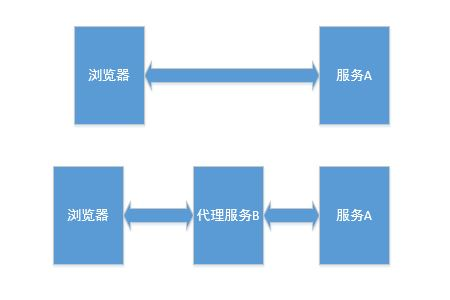

本例用node和express搭建的代理服务器。，期望目标如下：<br>
1、开启某服务A，该服务可实现若干功能,例如普通的restful请求，文件上传，静态资源访问等等。<br>
2、开启node代理服务B，指向服务A，访问代理服务B，可访问服务A的任意功能。<br>
就如下图所示：<br>
<br>
图中上半部分是直接访问服务，下班部分是通过代理服务器访问服务。<br>
使用代理服务器时，浏览器向代理服务器请求数据，代理服务器转发请求，并将接收到的数据返回给浏览器，即所有的数据都通过代理服务器转发。
带着这个目标，我们就讲述下如何实现该功能。<br>
既然是请求和响应转发，那我们就了解一下，什么是请求。<br>
### 请求和响应简述
http请求和响应主要右报文头部、空行和报文主体三个部分组成。<br>
空行我们不用关心，其实对我们来说，只要完成报文头部和报文主体的转发，就可以说实现了代理功能。<br>
请求和响应通过代理的整个过程如下：<br>
1、代理服务器接收请求后，在将目标服务数据返回给浏览器前要保持请求。<br>

2、提取请求路径、请求头、请求主体等数据。<br>

3、以2中提取的数据为参数，向目标服务器发送请求。<br>

4、接收目标服务器返回数据，提取响应头，响应主体等数据。<br>

5、将4中的提取出来的数据返回给客户端（浏览器）。<br>

6、断开连接。<br>
经过这几个步骤，就实现了代理。

### 代码实现
下面直接上代码，然后做一些讲解。代理函数如下：<br>
```javascript
const http = require('http');
const querystring = require('querystring');

//获取请求的cookie和query等
let getHeader = (reqClient) => {
    let headers = reqClient.headers; 
    headers.path = reqClient.path;
    headers.query = reqClient.query;
    headers.cookie = reqClient.get('cookie') || '';

    return headers;
}

//代理函数，options是代理设置，包括目标服务器ip，port等
let proxy = (options) => {
    let reqOptions = {
        hostname: options.host,
        port: options.port
    }
    //返回请求处理函数，reqClient浏览器的请求，resClient是响应浏览器的对象
    return function (reqClient, resClient) {
        //设置目标服务器的请求参数，头中的各项参数
        let headers = getHeader(reqClient);
        reqOptions.headers = reqClient.headers;
        let query = [];
        if (headers.query) {
            Object.keys(headers.query).map(key => {
                query.push(key + '=' + headers.query[key]);
            });
            reqOptions.path = headers.path + (query.length === 0 ? '' : ('?' + query.join('&')));
            
        }
        reqOptions.cookie = headers.cookie;
        reqOptions.method = reqClient.method;
        //向目标服务器发送请求,reqProxy是向目标服务器的请求，resProxy是目标服务器的响应。
        let reqProxy = http.request(reqOptions, (resProxy) => {
            resProxy.setEncoding('utf8');
            //设置返回http头
            resClient.set(resProxy.headers);
            resClient.status(resProxy.statusCode);
            //接收从目标服务器返回的数据
            resProxy.on('data', (chunk) => {
                //接收目标服务器数据后，以流的方式向浏览器返回数据
                resClient.write(chunk);
            });

            //接收目标服务器数据结束
            resProxy.on('end', () => {
                //向浏览器写数据结束。
                resClient.end();
            });
            //目标服务器响应错误
            resProxy.on('error', () => {
                //响应错误，结束向浏览器返回数据
                resClient.end();
            });
        });

        //接收浏览器数据
        reqClient.on('data', (chunk) => {
           //以流的方式向目标服务器发送数据
            reqProxy.write(chunk);
        });
        //接收数据结束
        reqClient.on('end', () => {
          //向目标服务器写数据结束
            reqProxy.end();
        });
        
        //普通JSON数据代理
         if (Object.keys(reqClient.body).length) {
             reqProxy.write(querystring.stringify(reqClient.body));
             reqProxy.end();
         }
    }
}

module.exports = proxy;
```
上面就是node代理的核心代码。支持普通的请求，静态资源代理，文件上传下载代理等功能。<br>

**git 地址：https://github.com/xubaodian/nodeProxy.git **<br>

demo中，核心代码在common/proxy.js里，我还实现了两个测试服务。<br>

在server文件下的app.js和app2.js是两个服务的入口文件。<br>

app2.js是目标服务器，有三个测试页面<br>
1、http://localhost:20000/json.html post请求测试，对应'/json'接口，可发送数据，f12查看请求是否成功 <br>
2、http://localhost:20000/upload.html 文件上传测试，对应接口'/upload'接口，上传文件，f12查看请求是否成功，同时在服务器upload文件夹下会有文件。<br>
3、http://localhost:20000/get.html  get请求测试，对应接口'/get'，同样f12查看<br>
app2为目标服务器，有3个接口。<br>
1、'/upload'接口，测试文件上传功能，上传文件将放在uploads文件夹下，上传的文件，文件名是一个uuid，没有后缀，添加后缀即可查看文件是完整。测试过，传1G的文件没问题，再大的文件没试过，有需要的可以试下<br>
2、'/json'，测试POST请求。<br>
3、'/get'，测试GET请求。<br>

app.js为代理服务为器，监听端口为18000,将所有请求转发至app2，即所有app2的接口静态资源，app中访问时一致的。<br>
测试步骤：
1、可开启目标服务器，通过三个页面测试功能。<br>
2、开启代理服务器，访问下面三个页面：<br>
   http://localhost:18000/json.html <br> 
   http://localhost:18000/upload.html<br>
   http://localhost:18000/get.html <br>
测试同样的功能。若和步骤1实现同样功能，则代理服务功能已经实现了。<br>
经过测试，代理功能是没问题的。<br>
如果问题欢迎留言，或发送邮件至472784995@qq.com。

至于性能，我没测过，因为我自己这边的应用场景，访问量都不大，可以使用。
